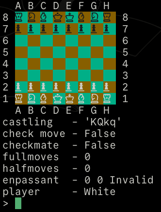

# Chess Engine
> Written in C



## How to use
- Running the program
```sh
make run
```

- Testing the program
```sh
make test
```

- Creating a build with debug flags
```sh
make debug
```

## Core Functionality
- Hand rolled dynamic arrays
- Testing using [unity](https://github.com/ThrowTheSwitch/Unity)
- Evaluation Function - [chessprogramming.org](https://github.com/ThrowTheSwitch/Unity)
- Move generation - Alpha beta pruning(NN todo)
